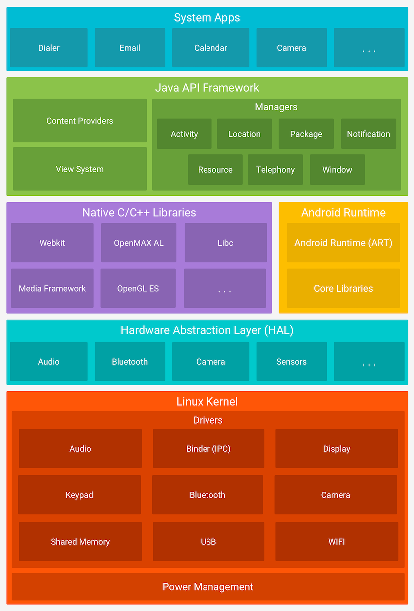

---

---
#### [Home](../README.md)

---


# Part 3 – Android Apps

Android Applications within the Linux Operating System.


The general structure of applications within the Android operating system and frameworks. The interplay of static resources and source code to make apps work. Ways of interaction with the operating system, such as life cycle callbacks to save state and/or communicate with other (system) apps.

## Android Applications ##

### Layers
* Five Layers
	
	* (5=Top) Apps
		* (5a) **System Apps**: Dialer, Email, Cal, Cam,...
		* (5b) Custom Apps: Installed by users
	
	* (4) **Java API Framework**: Content Provides, View System, Managers (Activity/Location/Package/Notification/Resource/Telephony/Window) 
	
	* (3) NativeLibs **OR** ART
		* (3a) Native C/C++ Libraries: Webkti, Libc, Media Framework, OpenGL ES, OpenMAX AL, ...
		* (3b) **Android Runtime** (ART) with Core Libraries 
			* supports Ahead-of-Time (AoT) compiling (in comparison to the previous Dalvik java virtual machine with Just-In-Time (JIT) compilation). 
	
	* (2) **Hardware Abstraction Layer** (HAL) for Audio/BT/Cam/Sensors/...
	
	* (1=Bottom): (**S**ecurity **E**nhanced) **Linux Kernel**
		* Drivers: Shared Memor, Binder (IPC), Audio, Display, Keypad, Bluetooth, Camera, USB, WIFI 
		* Power Management 

	 The image is taken from Android Developers / Platform /Technology / Platform Architecture  <https://developer.android.com/guide/platform>


## Android Apps

### Manifest
* Permissions

### Resources
* Internationalisation (i18n) for supporting multiple languages

* XML Layout files

* R

### Source Code

[Kotlin](../Part-1-Kotlin/study-material--kotlin.md) Source code.

* Source code is compiled into classes and assembled in **classes.dex** files. Multiple dex files are called **multidex**. The *.dex files and the resources are put into an Android Package ***.apk**. A more flexible way is to use Android bundles **.aab** allow the Android Play Store to dynamically customise an App before download for a given device. 


### Code to interact with the User Interface (UI)

Resources, such as UI elements are defined in XML layout files. They are assigned unique ids (which can be found in the auto-generated `R` file. After UI elements are loaded from XML files into memory they can be accessed via code. Kotlin source code uses ```findViewById``` to get a reference (and to access/modify/add listeners) to UI elements.

### Navigation (data passing)

* Start **activities** using **intents**

```startActivity()```, ```startActivityForResult()```

* Implicit vs. explicit intents
	
Implicit intents are dynamically found at runtime. Apps register available activities (see **intent filters**) which can be called by other apps. For example your app needs routing. Therefore an external app might be called using an **implicit intent**. The system finds the proper app for it (e.g. Google Maps or Open Street Map).  

* Navigation

	* Tab
	* Stack
	* Master-detail


### Life-cycle

* During an apps **life cycle** it changes between the states: *resumed*, *paused*, and *stopped*. Each transition triggers a callback. If needed, developers provice code to be executed for a specific callback, such as:
	* onCreate
	* onStart (onRestart)
	* onResume
	* onPause
	* onStop
	* onDestroy

* Layout, Views and Interaction

Layout is specified in XML files. The views are composed by nested views and widgets. Activities might exchange parts of the UI, called **fragments**. Activities, as well as fragments have their own **Life Cycles**. Use the **callbacks** to react on events, such as app is leaving the foreground.

For interaction swipe **gestures** and **taps** are used, so better try this with your fingers on *real* devices. 

### Usability

* Never block the User Interface (UI). Use concurrency mechanism (Kotlin coroutines) to prevent blocking the main thread.

* Save state! Use life cycle callbacks to preserve (and restore previous) state. The user should not even notice if an app was terminated between usage. 

* Reduce user input. Use sensors. Use haptic and/or sound feedback. Provide support for deep linking to start apps from a (mail/messenger) message, QR code or web page.

* Test on real devices. Do not perform usability tests in the emulator using the point-and-click metaphor of a mouse.


### Save battery

Use life cycle callbacks to reduce memory and CPU usage. Apps requiring fewer memory might be keept longer alive and are not terminated by the system. Apps requiring much energy, might be deinstalled by users.


### Services

Apps can be started as long running forground or background services. 

### Sensors and Actuators

* Sensors
	* Motion/Position: Gyroscope, Accelerator, GPS
	* Camera
	* Barometer (relative height), Temperature
	* Ambient Light

	 	
* Actuators
	* Vibration 

### Local and Push Notifications 
* Local notifications: listen to specific notification events or timer-notifications.
* Push notifications might be used with the Google **Firebase** infrastructure.

* Compare:
	* Cloud Synchronisation with **Firebase** 	

## Interaction between (system) apps

* Interprocess Communication (IPC)
* An app can register to listen for system events (broadcast receivers), such as SMS, phone calls, calendar alerts.
* **Deep Linking** with URI schemes. This allows one app to call (specific parts of) another app using a crafted URI, such as: ```adb shell am start -W -a android.intent.action.VIEW -d "slideshow://holiday/2023/17" slideshowapp.ims.iit.fhj.at```. 


--- 
#### [Next part: Android APIs](../Part-4-Android-APIs/study-material--android-apis.md). Android step-by-step development.

---

