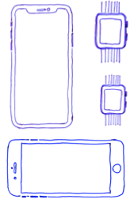
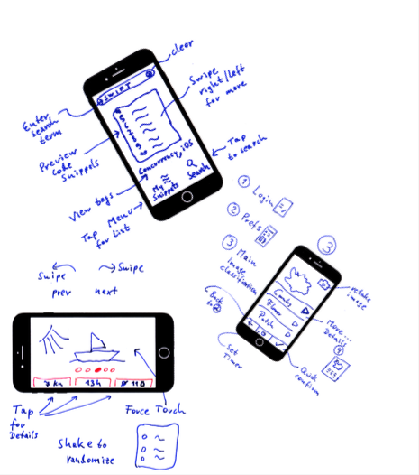

[up](../study-material--android-apis.md)

# Part 4 - Step 2 Paper Prototyping

How to create an app which solves a human user problem (instead of creating an app with features which might be only cool in programmer's minds).

## Short Version

* (1) Draw the app on paper
	* Draw scenes with data that could be *real*
	* Annotate possible interactions (swipe gesture, shake)
	* Use arrows for navigation

* (2) Try the app with reals users
	* Printed paper is ok   

* (3) Throw away 
	* Throw away not working prototypes
	* Improve! = Start over with step 1 for (at least) one more time.

## Details

* Design the **User Interface and User Interaction**
	* Personas and Scenarios
		* problem / solution for **target groups** 
	* Workflows (and user stories)
		* to accomplish x first .. then ...  
	* UX <= make it work efficient for *all* users
		* Provide best experience, stimulate/optimise motivation
		* Paper **prototypes**
			* E.g., 
		* Design GUI layout + **interaction** 
			* E.g.,  

* Derive (prioritised) main and optional **features**
	* Feature: requirement / passes test if 
	* Draw architecture: connected systems
	* Design data flow and lifecycle: 
		* Startup, pause app, save/restore state
		* Long-running (concurrent) background tasks
		* User input, data processing
		* Get from / store to external services
	* Specify data (exchange) formats (e.g. JSON)
		* required / used (external / custom) web service APIs	e.g. Restful / web socket .. selected technology: .. with prog-language: ..  
			* optional: Connect to existing servers / services 
			* optional: create own server / service 


* Documentation
	* Setup git repository and add files ```README.md``` and  ```.gitignore```:

		```
		*.iml
		.gradle
		/local.properties
		.idea/*
		!.idea/copyright
		.DS_Store
		/build
		/captures
		.externalNativeBuild
		ktlint
		```

	* Write a good ```README.md``` 
		* Including: problem(!) for the planned solution

		```
		# Collaborative Slideshow
		
		by <the-creative-student>, 2038
		
		The **collaborative** slideshow makes viewing memories more fun, because ... It provides ...
		
		## How to run
		
		Download apk from app store ...
		
		## How to develop
		
		Clone git repository from <git@git-iit.fh-joanneum.at/wherever>
		
		Configure API keys in file ... Open with Android Studio and run in emulator. 
		
		```
		
		* Add/link design documents (draft of overall architecture)


		```
		Find the app client, the cloud backend and its relations/interactions in Figure [System Architecture](./figures/architecture.pdf).
		```


[Next part: App Structure and Incremental Development](../03-Slideshow-Structure--Configuration+Directorystructure/README-03.md)


---

*This is the README-01.md of <https://git-iit.fh-joanneum.at/Feine/omd-droid-devel/Part-4-Android-APIs>.*