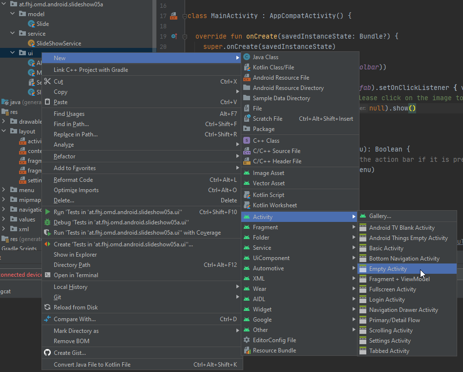
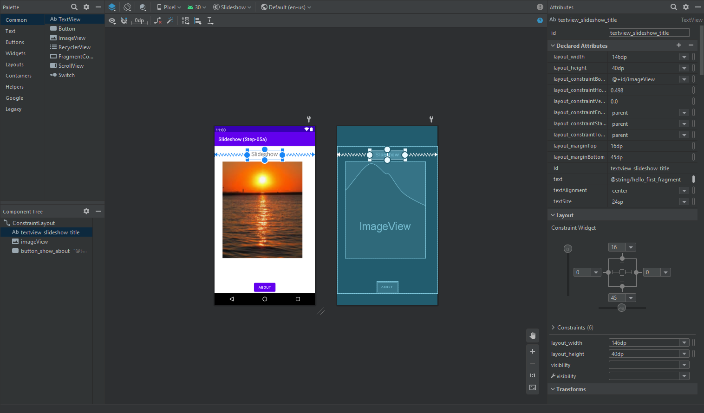

[up](../study-material--android-apis.md)

# Part 4 - Step 5a GUI With Static Images

Activities, Intents, Fragments: Display static slideshow images
The next steps will go in more depth.


## TL'DR: How to run the demo app in Android Studio

In Android Studio with the menu entry ```File/Open...``` select the subfolder ```src``` to be opened in ```New Window```. Or, just drag and drop the ```src``` folder onto your Android Studio Icon.

## Activities

Activities represent screens in the app for user interaction. They often correspond with a particular view or group of views. Activities can launch new activities and can exchange data.
* Creating an activity in Android Studio: Right click the package the activity has to belong to and choose New > Activity > Empty Activity
	
	
	This automatically adds it to the AndroidManifest.xml file:
	```xml
	<activity android:name=".ui.ExampleActivity"></activity>
	```
	
	And an empty Activity:
	```kotlin
	class ExampleActivity : AppCompatActivity() {
		override fun onCreate(savedInstanceState: Bundle?) {
			super.onCreate(savedInstanceState)
			setContentView(R.layout.activity_example)
		}
	```
* More on activities in [step 5b](../05b-Slideshow-GUI-StopShowOnOutgoingCall--AppLifecycle+BroadcastReceiver/README-05b.md)

## Intents

Intents are object that are used to communicate a desired action and to optionally pass data. The most important use case is for activities to communicate with each other.
* Start activity with intent:
	```kotlin
	val intent = Intent(this, SettingsActivity::class.java)
	intent.putExtra("city", "Kapfenberg")
	intent.putExtra("zipcode", 8605)
	startForResult.launch(intent)
	```
* Get intent info in launched activity:
	```kotlin
	// usually in onCreate method
	val intent = intent
    val city = intent.getStringExtra("city")
    val zipcode = intent.getIntExtra("zipcode",0)
    Log.i("SETTINGS","Now set $zipcode for $city. ... Not implemented yet ")
	```
* Return from activity with intent:
	```kotlin
	val retIntent =  Intent()
    retIntent.putExtra( "retData", "The result data string")
    setResult(Activity.RESULT_OK, retIntent)
    super.onBackPressed()
	```
* Listen for intent result of previously started activity:
	```kotlin
	private val startForResult = registerForActivityResult(ActivityResultContracts.StartActivityForResult()) { result: ActivityResult ->
		if (result.resultCode == Activity.RESULT_OK) {
			val intent = result.data
			if (intent is Intent){
				if (intent.hasExtra("retData")){
					val getValue = intent.getStringExtra("retData")
					Log.i("MENU","we got return value '$getValue'")
				}else{
					Log.i("MENU","we got no known return values")
				}
			}else{
				Log.i("MENU","we got no return values")
			}
		}
	}


## Fragments for improved **reusability**

Fragments are reusable pieces of UI. They have to be contained within an activity or another fragment.
* Fragments can be created analogously to creating an activity in Android Studio.
* Display a fragment from an activity in a layout file:
	```xml
	<fragment
        android:id="@+id/nav_host_fragment"
        android:name="androidx.navigation.fragment.NavHostFragment" />
	```
* More on activities in [step 5c](../05c-Slideshow-GUI-Navigation-List+Details--Navigation/README-05c.md)

## Layouts with views (within a view hierarchy):

Android uses xml files for defining the layout of a view. They are stored in app/res/layout/. They can be easily made with the designer.


## Connect code to view

* Get view element by id:
	```kotlin
	val backButton = view.findViewById<Button>(R.id.button_back_to_slideshow)
* Get view element attribute value:
	```kotlin
	val slideshowTitle = view.findViewById<TextView>(R.id.textview_slideshow_title).text
	```
* Change view element attribute value:
	```kotlin
	view.findViewById<TextView>(R.id.textview_slideshow_title).text = "Slideshow title changed"
	```
* Add event listener to view element:
	```kotlin
	view.findViewById<Button>(R.id.button_back_to_slideshow).setOnClickListener {
      	Log.i("BUTTON", "Back button clicked")
    }
	```

[Next part: Part 4 - Step 5b Android Life-cycle, Broadcast Receivers](../05b-Slideshow-GUI-StopShowOnOutgoingCall--AppLifecycle+BroadcastReceiver/README-05b.md)


---

*This is the README-05a.md of <https://git-iit.fh-joanneum.at/Feine/omd-droid-devel/Part-4-Android-APIs>.*