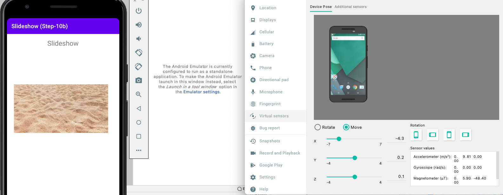

[up](../study-material--android-apis.md)

Mobile devices support various sensor input.

# Step 10b Shake

* Encapsulate your logic to detect a significant change in acceleration (i.e. a **shake** motion)


	```kotlin
	object ShakeDetector{
	  private const val THRESHOLD:Float = 7f
	  private const val DELAY:Long = 800_000_000 // in nano, i.e. 0.8 sec.
	  private var _lastAcc:Float = SensorManager.GRAVITY_EARTH
	  private var _currAcc:Float = SensorManager.GRAVITY_EARTH
	  private var _lastTime:Long = 0
	  public fun 
	  
	  isPhoneShaken(evt:SensorEvent):Boolean{ 
	    if ((evt.timestamp - _lastTime) < DELAY ) return false
	
	    val (x,y,z) = evt.values
	    _lastAcc = _currAcc
	    _currAcc = sqrt(x.pow(2)+y.pow(2)+z.pow(2)).toFloat()
	    val delta = abs(_currAcc - _lastAcc)
	    
	    val shaken = delta > THRESHOLD
	    if (shaken) {
	      _lastTime = evt.timestamp
	    }
	    return shaken
	  }
	}
	
	```


* Provide variable for the **sensor manager** and the **sensor event listener**:

	```kotlin
	private var _sensorManager:SensorManager? = null
		
	private val _sensorEventListener = object: SensorEventListener {
		override fun onSensorChanged(event: SensorEvent?) {
		  event ?: return
		
		  if ( ShakeDetector.isPhoneShaken(event) ){
		    Log.i("SENSOR","Significant sensor input. User has shaken the phone. Proceed to next slide...")
		    showNextSlide()
		  }
		}
		
		override fun onAccuracyChanged(sensor: Sensor?, accuracy: Int) {
		  Log.i("SENSOR","Ignoring accuracy changed event for sensor: ${sensor}. New accuracy: ${accuracy}")
		}
	}
	```

* Create, enable and disable the motion sensor on life-cycle events:

	```kotlin
	override fun onCreateView(...
	
	    _sensorManager = context?.getSystemService(SENSOR_SERVICE) as SensorManager
		...
		
	override fun onResume() {
		super.onResume()
		val sensor:Sensor? = _sensorManager?.getDefaultSensor(
		        Sensor.TYPE_ACCELEROMETER)
		
		_sensorManager?.registerListener(
		        _sensorEventListener,
		        sensor,
		        SensorManager.SENSOR_DELAY_UI)
	}
	
	override fun onPause() {
		_sensorManager?.unregisterListener(_sensorEventListener)
		super.onPause()
	}

	```

### Hints on the emulator


Launch emulator in **standalone** mode to get access to the more ```...``` menu, as shown in following figure: 



[Next part: Part 6 Android Security](../../Part-5-Android-Sys/study-material--android-sys.md)

---

*This is the README-10b.md of <https://git-iit.fh-joanneum.at/Feine/omd-droid-devel/Part-4-Android-APIs>.*